# VectorCAST Reqs2x Documentation and Tutorial

## Overview

The **VectorCAST Reqs2x tools** provide LLM-powered capabilities for requirements engineering and test generation workflows. These tools leverage large language models to:

- **Generate requirements from source code** 
- **Infer traceability between requirements and code** 
- **Generate VectorCAST test cases from requirements** 

All tools require a configured LLM provider to function. The tools support multiple LLM providers including Azure OpenAI, OpenAI, Anthropic, and LiteLLM.  

This manual demonstrates Reqs2x usage workflows from inside this VS-Code extension using the `TUTORIAL_C` demo environment. Before starting, ensure you have the necessary components ready.

## 1. Setup and Installation

### Prerequisites
1.  **Uninstall Previous Versions**: Remove any existing versions of the VectorCAST VS-Code extension.
2.  **Prepare Reqs2x Core**:
    *   Extract the Reqs2x core release (`autoreq-win.tar.gz` or `autoreq-linux.tar.gz`).
    *   Locate the `bin` folder (executables) and `TUTORIAL_C` folder (demo environment).
3.  **License Setup**: Ensure your VectorCAST license is configured. Ideally, point `VECTORCAST_DIR` to your release.
4.  **Open Project**: Open a terminal and navigate to the extracted `autoreq-win/distribution/TUTORIAL_C` directory.

### VS Code Extensions
1.  Install the **Excel Viewer** extension (`GrapeCity.gc-excelviewer`) to view/edit Excel sheets directly in VS Code.
2.  Install the **VectorCAST Text Explorer** VS-Code extension from the Microsoft Marketplace.

### Configuration
1.  Activate the extension: Press `Ctrl+Shift+P`, search for **Vectorcast Test Explorer**, and press `Enter`.
2.  Open the **Settings** tab (opens automatically).
3.  Configure the following settings:
    *   **Vectorcast Test Explorer › Reqs2x: Installation Location**: Point this to the `autoreq-win/distribution/bin` folder you extracted earlier.
    *   **Vectorcast Test Explorer › Reqs2x: Provider**:
    Select the large language model provider you intend to use from the dropdown menu
        * **Note**: Most providers support the `openai` API. This includes `Google`, `AWS Bedrock`, as well as open-source model-serving methods like `ollama`, `vLLM` and `SG-Lang`. Use [LiteLLM](https://github.com/BerriAI/litellm) for any provider not supporting `openai`/`openai_azure` API. 
    *   For the provider you selected, fill in:
        - **Vectorcast Test Explorer › Reqs2x > <YourProvider>: Base Url**
        
            This is your large language model endpoint.
        - **Vectorcast Test Explorer › Reqs2x > <YourProvider>: Api Key** 
        
            The API key for your provider. **Note**: for on-prem providers like `ollama` and `vLLM` you can set this field to `none`.
        
        - **Vectorcast Test Explorer › Reqs2x > <YourProvider>: Model Name** 
            
            Name of the large language model you will be using. For example: `gpt-4.1`, `gpt-4.1-mini`, `Qwen/Qwen3-30B-A3B-Instruct-2507` (from `Hugging Face`), `gpt-oss:20b` (from `ollama`) etc.
        - **Vectorcast Test Explorer › Reqs2x > <YourProvider>: Deployment Name** 
            Name of the large languge model deployment you intend to use - you may have multiple deployments of the same large language model.

    *   **Vectorcast Test Explorer › Reqs2x: Generation Language**

        Select the requirements language from the dropdown menu.
    *   **Vectorcast Test Explorer › Reqs2x: Enable Reqs2x Feature**:

        Tick this box to activate Reqs2x.

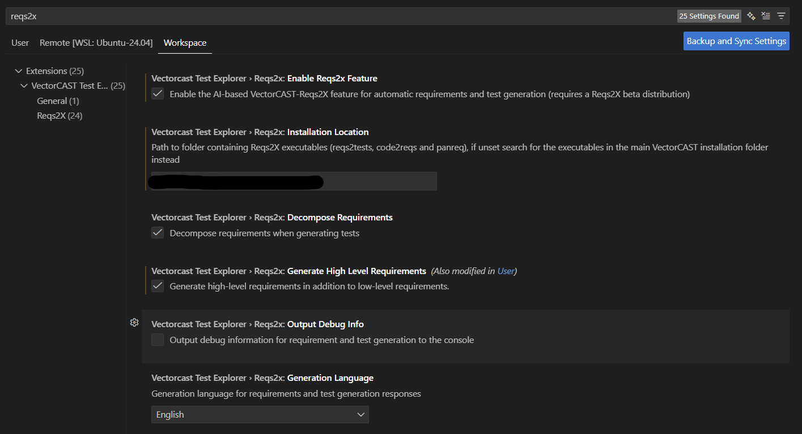

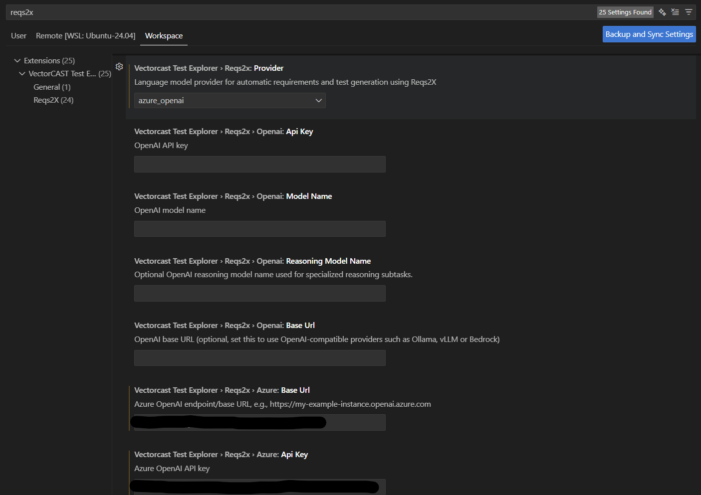

4. Optional settings:
    *   **Vectorcast Test Explorer › Reqs2x: Decompose Requirements**:
    This option is enabled per default. Untick this box if you **do not want Reqs2x to automatically decompose** your requirements.
        - **Note**: With decomposition inactive, Reqs2x will only generate a single test for each of your requirements.
    *   **Vectorcast Test Explorer › Reqs2x: Generate High Level Requirements**:
    Tick this box if you are using `Reqs2x` for generating requirements from code and want to generate module-level requirements
    *   **Vectorcast Test Explorer › Reqs2x: Output Debug Info**:
    Tick this box to log more details during requirement/test generation. The logs can be found in the `OUTPUT` tab of the VS-Code bottom bar by selecting `VectorCAST Requirement Test Generation Operations` from the output channel dropdown menu in the lower-right corner.

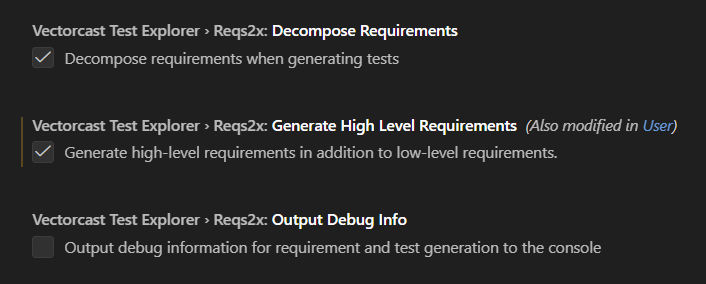

### Environment Setup
1.  In the Explorer view, right-click the `.CFG` file and select **Set as VectorCAST Configuration file**.
2.  Ensure `ENVIRO.SEARCH_LIST` is set to `.` for code coverage.
3.  Right-click `TUTORIAL_C.env` and select **Build VectorCAST environment**.

---

## 2. Generating Tests from Requirements

The demo release includes an Excel file with requirements and requirements-to-code traceability.

### Initial Setup
1.  Click the **Flask icon** (Test Explorer) on the left sidebar to show the environment tree.
2.  Right-click `TUTORIAL_C` and select **VectorCAST -> Show Requirements**. The requirements webview will appear.
3.  Right-click `TUTORIAL_C` and select **VectorCAST -> Populate RGW from Requirements**.
    *   *Note: This creates a requirements gateway and populates it from the Excel sheet. Wait for the notification (approx. 3-5 seconds).*
    *   If you do not have the requirements-to-code traceability for a function, Reqs2x will generate it automatically with your approval.
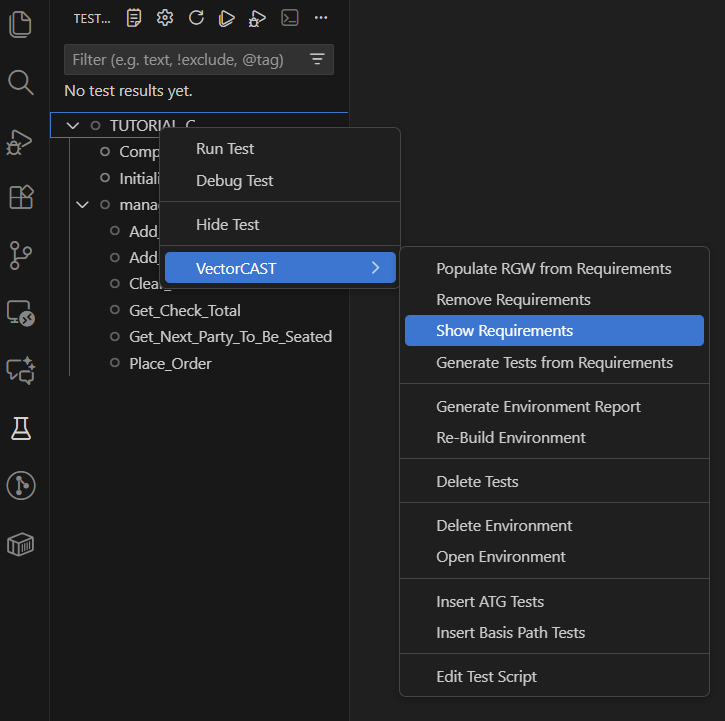
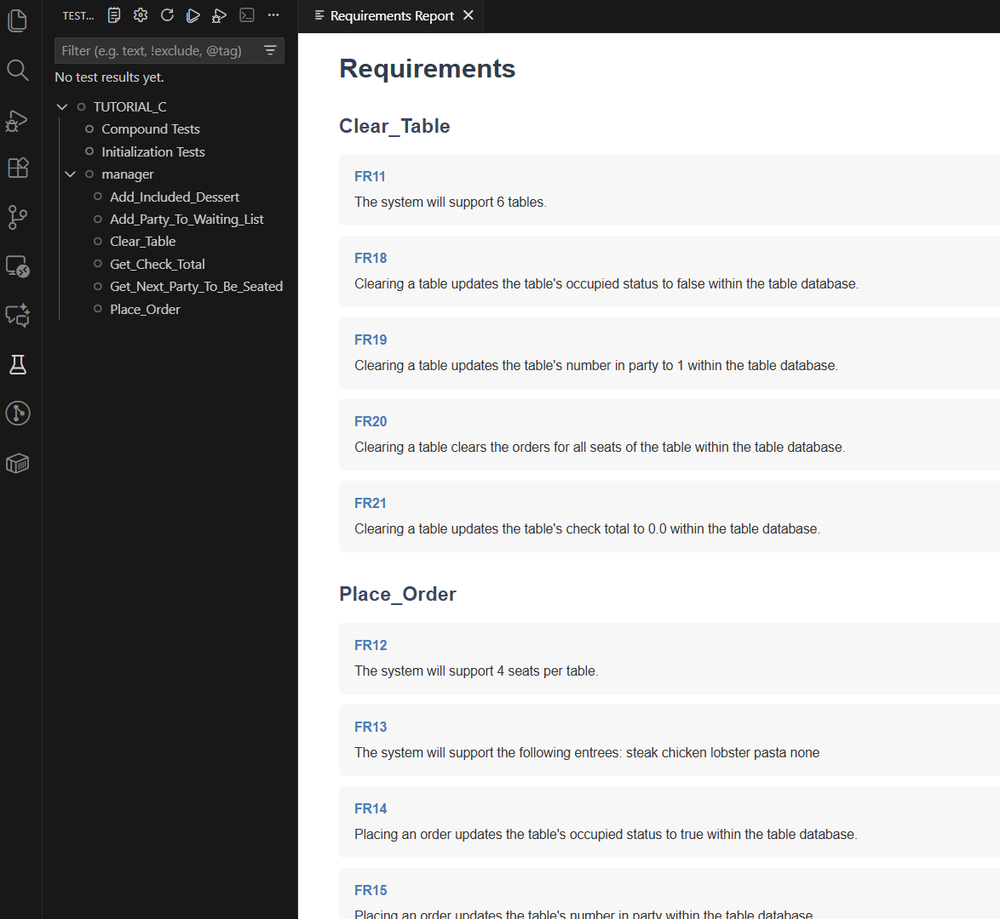
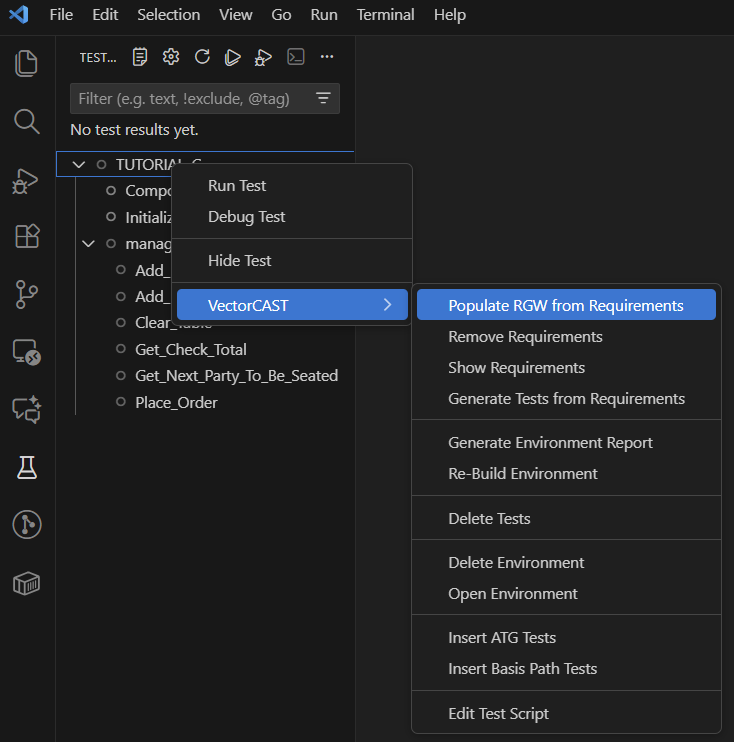

### Test Generation
1.  Right-click `TUTORIAL_C` and select **VectorCAST -> Generate Tests from Requirements**.
    *   A progress bar will appear. This may take 1-2 minutes.
2.  Monitor progress: Open the **OUTPUT** pane and select **VectorCAST Requirement Test Generation Operations**.

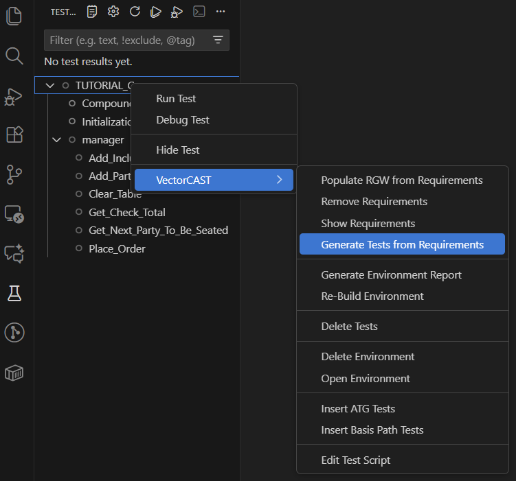

### Reviewing Results
1.  **Analyze Requirements**:
    *   Open the Requirements webview and place it side-by-side with `manager.c`.
    *   Locate `FR27 Add Included Dessert`. Note that it describes **three distinct behaviors** 
        (2 order combinations that qualify for different free dessert and no dessert for any other order combination).
    *   The system decomposes this into atomic requirements and generates corresponding tests.
2.  **Verify Tests**:
    *   In the Test Explorer, find the `Add Included Dessert` node. You should see 3 tests.
    *   Right-click a test (e.g., one for free pie) and select **VectorCAST -> Edit Test Script**.
    *   Observe the `REQUIREMENT.KEY` for traceability and `TEST.NOTES` for the description of an atomic behavior that the generated test is validating.

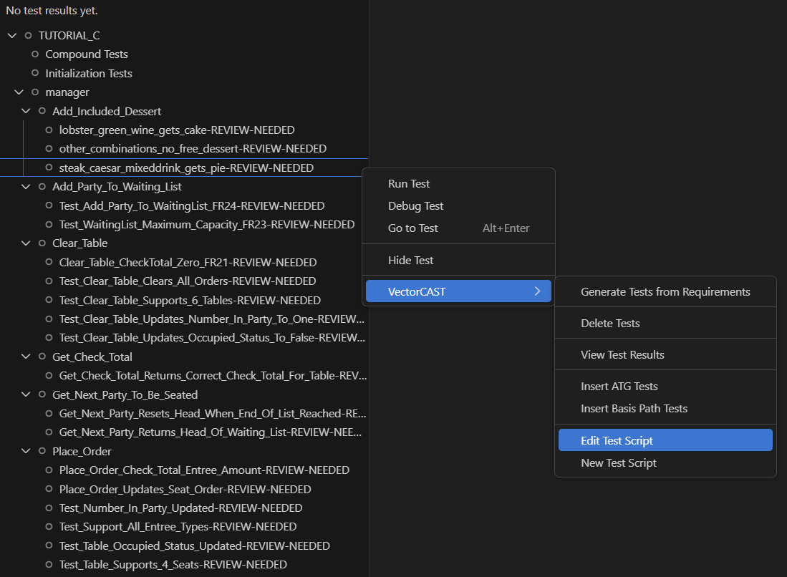
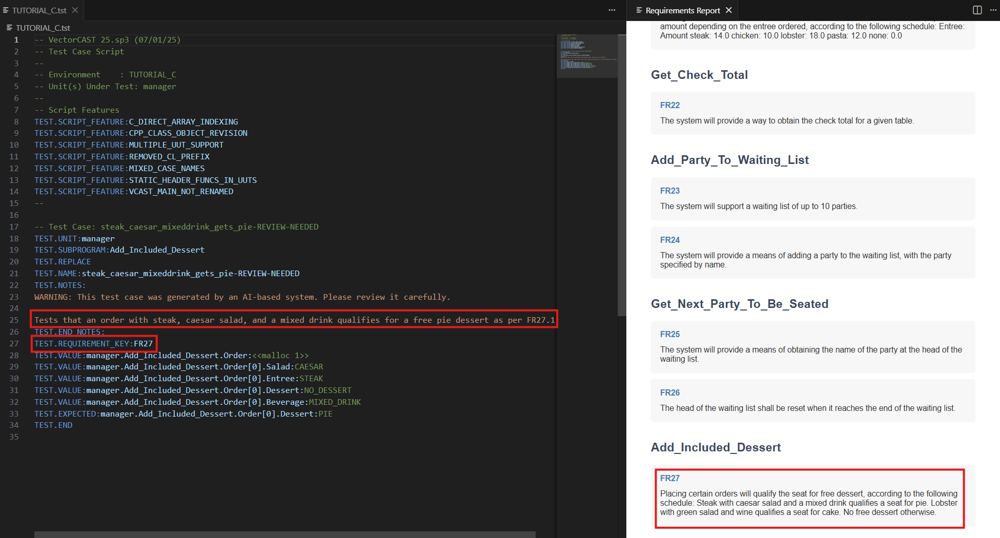

### Execution and Coverage
1.  Click the **Run** button next to `TUTORIAL_C` to execute all tests.
2.  Open `manager.c` to inspect code coverage (check the bottom bar or gutter).
    - *Note*: You can open the environment in VectorCAST GUI to inspect the results. The generated tests are no different than manually-created `tst` files fundamentally - you can apply the same downstream operations

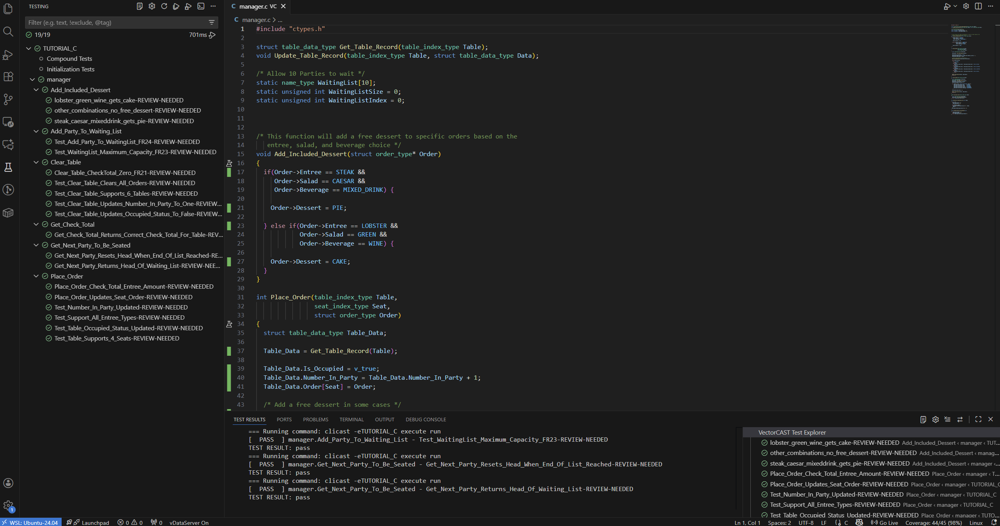
---

## 3. Handling Requirement Changes

1.  **Modify requirement**:
    *   Open `reqs.xlsx` using the Excel Viewer.
    *   Find `FR27` (Add Included Dessert). 
    *   Change the free dessert for `steak, caesar salad and mixed drink` from `pie` to `cake`.
    *   Change the free dessert for `lobster, green salad and wine` from `cake` to `pie`.
    *   Save (`Ctrl+S`) and close the tab.
    *   Right-click `TUTORIAL_C` and select **VectorCAST -> Populate RGW from Requirements** to push the change to the requirements gateway. You will be prompted to accept replacing the old requirements gateway with the new one. 

2.  **Update tests**:
    *   In Test Explorer, find the `Add_Included_Dessert` node.
    *   Right-click `Add_Included_Dessert` and select **VectorCAST -> DeleteTests**.
    *   Right-click `Add_Included_Dessert` again and select **VectorCAST -> Generate Tests from Requirements**.
        * This will generate tests only for the requirements related to `Add_Included_Dessert` function.

---

---

3.  **Verify failure**:
    *   Run the newly generated tests (some may contain "PARTIAL" in the name).
    *   The tests under `Add_Included_Dessert` should **fail** because the code still implements the old requirement.
    *   Right-click on a test under `Add_Included_Dessert` and select **VectorCAST -> Edit Test Script**. to confirm the expected value for the free dessert indeed matches the new requirement.
    *   **Note**: Reqs2x **considers requirements to be the source of truth** and gives them preference if there are discrepancies between the code and the requirements.

4.  **Adapt the code to match the requirement**:
    *   Open `manager.c` (line 21) and change `Order->Dessert` to be assigned `CAKE`
    *   Open `manager.c` (line 27) and change `Order->Dessert` to be assigned `PIE`
    *   Right-click `TUTORIAL_C` and select **VectorCAST -> Re-build environment**.
    *   Run the failing test again. It will now **pass**.

---

## 4. Generating Requirements from Code

You can also generate requirements directly from existing code.

1.  **Clean Up**:
    *   Delete existing tests: Right-click `TUTORIAL_C` -> **VectorCAST -> Delete Tests**.
    *   Clear results: Click `...` in the Test Explorer -> **Clear all results**.
    *   Remove requirements: Right-click `TUTORIAL_C` -> **VectorCAST -> Remove Requirements**.

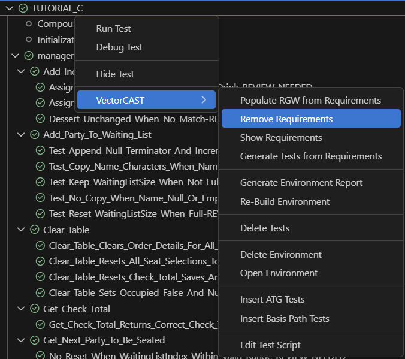

2.  **Configuration (Optional)**:
    *   In Settings, enable **Vectorcast Test Explorer › Reqs2x: Generate High Level Requirements** if desired.

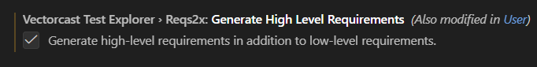

3.  **Generate**:
    *   Right-click `TUTORIAL_C` -> **VectorCAST -> Generate Requirements**.
    *   Wait for the notification.
    *   A requirements gateway (RGW) will be created automatically.
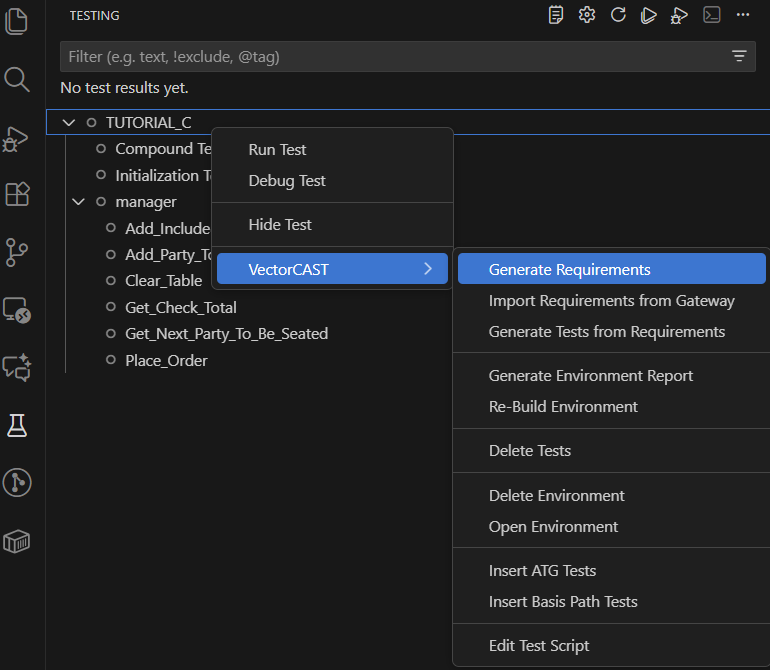

4.  **Review**:
    *   Right-click `TUTORIAL_C` -> **VectorCAST -> Show Requirements**.
    *   Observe the generated low-level (and optionally high-level) requirements.
    *   Module-level requirements can be found at the bottom of the webview sorted under module name, which is `manager` in this case.
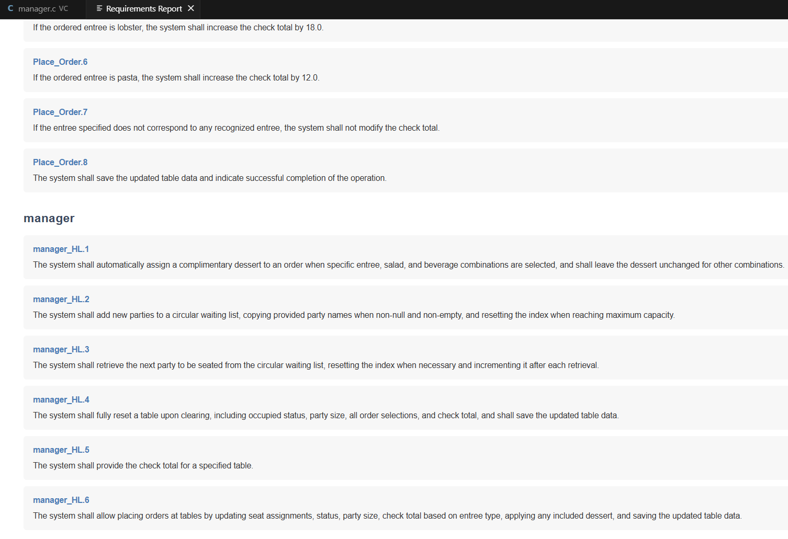
5.  **Generate Tests**:
    *   Right-click `TUTORIAL_C` -> **VectorCAST -> Generate Tests from Requirements**.
    *   **Note**: We can observe that more tests get generated from generated requirements then from the original requirements (24 instead of 17). This is due to generated requirements being more fine-grained and exhaustively describing the implementation.

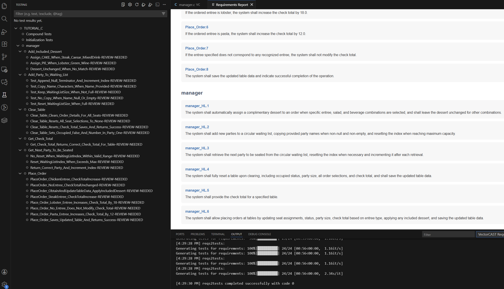